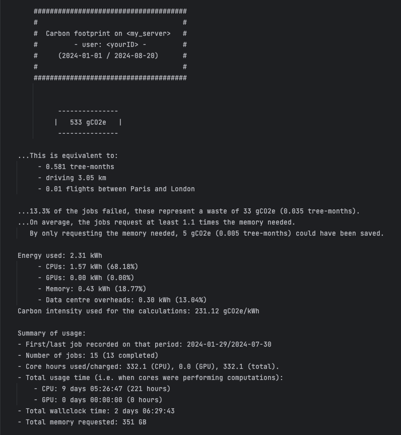

# GA4HPC: Green Algorithms for High Performance Computing

> :point_right: There are many different flabours of SLURM setups, so no doubt you'll find some bugs... 
please let us know what you find so that we can make it work for more people! 

The aim of this code is to implement the Green Algorithms framework 
(more [here](https://onlinelibrary.wiley.com/doi/abs/10.1002/advs.202100707) 
and on [www.green-algorithms.org](www.green-algorithms.org)) 
directly on HPC clusters powered by SLURM (although it could work for other workload managers, see below).

As a user, it pulls your usage statistics from the workload manager's logs and then it estimate your carbon footprint based on this usage.
It reports a range of statistics such as energy usage, carbon footprints, compute use, memory efficiency, impact of failed jobs etc.

The default output is in the terminal (example below), but we have now added the option of a richer html output (example coming soon).



## Quick start

The tool only needs to be installed once, preferably in a shared drive so that all users can access it without installing 
it for themselves.

:warning: Even if it's in a shared drive, each user will only be able to see their own usage. 
However, if the HTML output is used without a custom output directory, the report will be also located on the shared drive
(more on this below).

### If GA4HPC is not installed yet

Then it's on you to install it: see below for installation guide

### If GA4HPC is already installed

Then you can run it straight away to find out your own carbon footprint. 
Assuming it's installed in `shared_directory`, all you have to do is to run the command below on the SLURM cluster to obtain the carbon footprint between two dates. 
```bash
shared_directory/myCarbonFootprint.sh --startDay 2024-01-10 --endDay 2024-08-15
```

You can customise the output with a number of options (full list below), but the main ones are:
- `-S --startDay` and `-E --endDay`: formatted at YYY-MM-DD to restrict the logs considered. 
- `-o --output`: `-o terminal` to have the terminal output (default) or `-o html` for the html report. 
In case of the html report, a subdirectory will be created for it. 
By default, it's under `GreenAlgorithms4HPC/outputs/`, but this can be changed. 
- `--outputDir` to provide a path where to export any output. 

### Limitations to keep in mind

 - The workload manager doesn't alway log the exact CPU usage time, and when this information is missing, we assume that all cores are used at 100%.
 - For now, we assume that GPUs are used at 100% (as the information needed for more accurate measurement is not available)
 (this may lead to slightly overestimated carbon footprints, although the order of magnitude is likely to be correct)
 - Conversely, the wasted energy due to memory overallocation may be largely underestimated, as the information needed is not always logged.


## Full list of options

```
usage: __init__.py [-h] [-S STARTDAY] [-E ENDDAY] [-o OUTPUT] [--outputDir OUTPUTDIR] [--filterCWD] [--filterJobIDs FILTERJOBIDS] [--filterAccount FILTERACCOUNT] [--customSuccessStates CUSTOMSUCCESSSTATES]
                   [--reportBug | --reportBugHere] [--useCustomLogs USECUSTOMLOGS]

Calculate your carbon footprint on the server.

optional arguments:
  -h, --help            show this help message and exit
  -S STARTDAY, --startDay STARTDAY
                        The first day to take into account, as YYYY-MM-DD (default: 2024-01-01)
  -E ENDDAY, --endDay ENDDAY
                        The last day to take into account, as YYYY-MM-DD (default: today)
  -o OUTPUT, --output OUTPUT
                        How to display the results, one of 'terminal' or 'html' (default: terminal)
  --outputDir OUTPUTDIR
                        Export path for the output (default: under `outputs/`). Only used with `--output html` and `--reportBug`.
  --filterCWD           Only report on jobs launched from the current location.
  --filterJobIDs FILTERJOBIDS
                        Comma separated list of Job IDs you want to filter on. (default: "all")
  --filterAccount FILTERACCOUNT
                        Only consider jobs charged under this account
  --customSuccessStates CUSTOMSUCCESSSTATES
                        Comma-separated list of job states. By default, only jobs that exit with status CD or COMPLETED are considered successful (PENDING, RUNNING and REQUEUD are ignored). Jobs with states listed here will
                        be considered successful as well (best to list both 2-letter and full-length codes. Full list of job states: https://slurm.schedmd.com/squeue.html#SECTION_JOB-STATE-CODES
  --reportBug           In case of a bug, this flag exports the jobs logs so that you/we can investigate further. The debug file will be stored in the shared folder where this tool is located (under /outputs), to export it to
                        your home folder, user `--reportBugHere`. Note that this will write out some basic information about your jobs, such as runtime, number of cores and memory usage.
  --reportBugHere       Similar to --reportBug, but exports the output to your home folder.
  --useCustomLogs USECUSTOMLOGS
                        This bypasses the workload manager, and enables you to input a custom log file of your jobs. This is mostly meant for debugging, but can be useful in some situations. An example of the expected file
                        can be found at `example_files/example_sacctOutput_raw.txt`.
```

## Installation guide

:point_right: Only needs to be installed once on a cluster, check first that someone else hasn't installed it yet!

### Requirements
- Python 3.8+ (can probably be adjusted to older versions of python fairly easily).

### Step-by-step

1. Clone this repository in a shared directory on your cluster:
    ```bash
    $ cd shared_directory 
    $ git clone https://github.com/Llannelongue/GreenAlgorithms4HPC.git
    ```

2. Edit `myCarbonFootprint.sh` line 20 to create the virtual environment with Python 3.8 or later. 
The default line is:
    ```bash
    /usr/bin/python3.8 -m venv GA_env
    ```
    But it may be something else on your server, for example:
    ```bash
    module load python/3.11.7
    python -m venv GA_env
    ```

3. Make the bash script executable: 
    ```bash
    $ chmod +x shared_directory/GreenAlgorithms4HPC/myCarbonFootprint.sh
    ```

4. Edit `cluster_info.yaml` to plug in the values corresponding to the hardware specs of your cluster
   (this is the tricky step). You can ask your HPC team and 
   you can find a lot of useful values on the Green Algorithms GitHub: https://github.com/GreenAlgorithms/green-algorithms-tool/tree/master/data

5. Run the script a first time. It will check that the correct version of python is used 
and will create the virtualenv with the required packages, based on `requirements.txt`:
```shell script
$ shared_directory/GreenAlgorithms4HPC/myCarbonFootprint.sh
```

### How to update the software once installed

_More elegant solutions welcome! [Discussion here](https://github.com/Llannelongue/GreenAlgorithms4HPC/issues/1)._

⚠️ Make sure you have saved your custom version of `cluster_info.yaml` 
and the way to load python3.8 the first time.

- `git reset --hard` To remove local changes to files (hence the need for a backup!)
- `git pull`
- Update `cluster_info.yaml` and `myCarbonFootprint.sh` as described above.
- `chmod +x myCarbonFootprint.sh` to make it executable again
- Test `myCarbonFootprint.sh` 

## FAQ

### Can it work other other workload managers?

Yes it can, but we have only written the code for SLURM so far. 
What you can do is to adapts [`slurm_extract.py`](backend/slurm_extract.py) for your own workload manager.

In a nutshell, you just need to create a variable `self.df_agg_X` similar to the example file [here](example_files/example_output_workloadManager.tsv)
(only the columns with a name ending in X in the code are needed).

### How to debug errors
There are some example of intermediary files in [example_files/](example_files/).

For the workload manager part of the code:
- [The raw output](example_files/example_sacctOutput_raw.txt) ([here](example_files/example_sacctOutput_raw_asDF.tsv) as a table) from the `sacct` SLURM command (this is the command pulling all the logs from SLURM), i.e. `WM.logs_raw`, the output of `WM.pull_logs()`.
- [The cleaned output of the workload manager step](example_files/example_output_workloadManager.tsv), i.e. `WM.df_agg`, the output of `WM.clean_logs_df()`. Only the columns with a name ending with X are needed (the other ones are being used by the workload manager script). NB: the `pd.DataFrame` has been converted to a csv to be included here.
